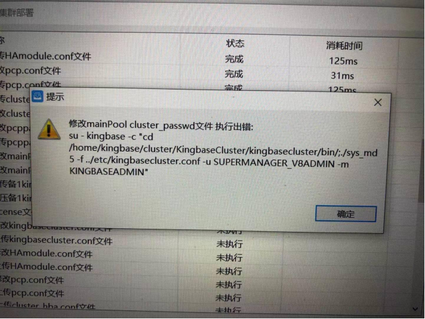
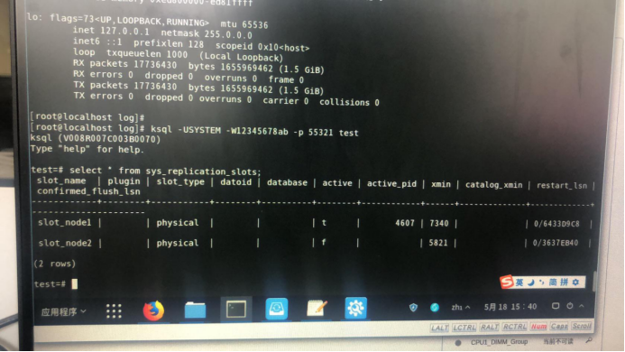

高可用集群
===============================

libssl 问题
---------------------

适用版本：V8R3

系统环境：飞腾+银河

数据库版本：kingbaseES V8

问题现象：通过部署工具部署HA成功后，通过命令启动集群服务失败；通过ssh ip访问node失败。

解决方案：修改 V8/lib库下ssl和crypto两个文件，改名即可：

.. code::

   #mv     libssl.so.1.0.0        libssl.so.1.0.0.bak
   #mv    libcrypto.so.1.0.0  libcrypto.so.1.0.0.bak
 
附件：

1、查看ssh库函数信息

.. image:: images/cluster_FAQ266.png
   :width:  400px
   :height: 184px

if_up_cmd faild
---------------------

适用版本：V8R3

系统环境：鲲鹏+中标麒麟V7

数据库版本：kingbaseES V008R003C002B0100

问题现象：集群通过部署工具部署成功，kingbasecluster启动失败，故障提示“if_up_cmd faild”

故障日志：

.. code::

   2020-09-01 19:19:21: pid 910408: LOG:  createing watchdog heartbeat receive socket.

   2020-09-01 19:19:21: pid 910408: DETAIL:  bind receive socket to device: "enp4s0f1"

   2020-09-01 19:19:21: pid 910408: LOG:  set SO_REUSEPORT option to the socket

   2020-09-01 19:19:21: pid 910408: LOG:  creating watchdog heartbeat receive socket.

   2020-09-01 19:19:21: pid 910408: DETAIL:  set SO_REUSEPORT

   2020-09-01 19:19:21: pid 910405: LOG:  failed to acquire the delegate IP address

   2020-09-01 19:19:21: pid 910405: DETAIL:  'if_cmd' failed

   2020-09-01 19:19:21: pid 910405: WARNING:  watchdog escalation failed to acquire delegate IP

   2020-09-01 19:19:21: pid 910405: LOG:  send the node status change to watchdog

   2020-09-01 19:19:21: pid 910405: DETAIL:  node id :0 status = "NODE DEAD" message:"failed to acuqire delegate IP, set node down"

   2020-09-01 19:19:21: pid 909801: LOG:  new IPC connection received

   2020-09-01 19:19:21: pid 909801: LOG:  received node status change ipc message

   2020-09-01 19:19:21: pid 909801: DETAIL:  failed to acuqire delegate IP, set node down

问题现象：哈尔滨市委BMJ三期，BMJ 部署集群cluster VIP一直做切换，集群异常

问题发生时间：2020-10-21

产品版本：KingbaseES V8 R7 0070

运行平台：飞腾2000+ 麒麟

问题分析人: 胡全、赵显平

ims号：2020-10-2100640 

解决方案：

   1、查看arping版本：s20190709

   2、利用公司提供的arping替换现有的arping

   .. code::

      [kingbase@master kingbasecluster]$ arping -V
      arping utility, iputils-s20160308

arping问题
---------------------

适用版本：V8R3

系统环境：鲲鹏920+统信V20（服务器版）

数据库版本：kingbaseES V008R003

问题现象：部署工具部署三节点集群，在启动数据库时启动超时，启动失败。

故障日志：

.. image:: images/cluster_FAQ1846.png
   :width: 400px
   :height: 184px

解决方案：

   1、查看arping版本信息：arping -v

   2、在arping的版本信息中包含：“iputils”字样

   3、需要从公司获取专用的arping版本

arping_path版本不正确
---------------------

适用版本：V8R3

系统环境：飞腾2000+麒麟v10（服务器版）

数据库版本：kingbaseES V008R003

问题现象：部署工具部署集群，在启动集群后，集群两个node宕机

故障日志：

解决方案：

   1、查看arping版本信息：arping -v

   2、在arping的版本信息中包含：“iputils”字样

   3、需要从公司获取专用的arping版本

esHAmodel.sh脚本错误
---------------------

适用版本：V8R3

.. image:: images/cluster_FAQ2163.png
   :width: 400px
   :height: 33px

.. image:: images/cluster_FAQ2165.png
   :width: 400px
   :height: 31px

系统环境：海光+中科方德SVS2.16.2

数据库版本：V008R007C003B0070

问题现象：BMJ部署集群时，执行esHAmodel.sh脚本报错

故障现象：

查找crond可执行文件：（crond文件存在，但是which无法查找到）

查看crontab service：

.. image:: images/cluster_FAQ2313.png
   :width: 400px
   :height: 203px

解决方案：

   1、首先查看crontab service服务是否正常启动。

   2、查看crontab service对应的可执行文件crond是否正常（which crond）

   3、如果crond文件存在（如/usr/sbin/crond）但是which无法查看，PATH路径设置正常。

   4、将/usr/sbin/crond文件拷贝到/usr/bin下，which crond可以查看到。

   5、启动esHAmodule.sh start正常，问题解决。

   6、发现中科方德保密机系统也存在这个问题，可以用相同的方法解决。

集群名称不能使用cluster
-----------------------------

适用版本：V8R3

系统环境：统信服务器操作系统uos 20 SP1,鲲鹏cpu

数据库版本：V008R003C002B0160_Aarch64

问题现象：部署集群时报错，重新部署成功。

故障现象：

解决方案：

 1、在此集群部署中，集群名称使用了“cluster”，导致文件访问错误。

 2、在集群部署中，不要使用“cluster”作为集群名称。

网络问题导致备机无法加入集群
---------------------------------------

适用版本：V8R3

项目描述：中组部

问题时间： 2020/10/29

问题分析及结果：集群故障处理，备机db节点持续重启，无法加入集群。

数据库版本：专用机V8R7C003B0070

问题现象描述：主机故障后，恢复成备机节点，此后每分钟该节点数据库不断启动，停止，一直无法加入集群

问题分析：备节点不断重启，通过日志观察，是因为在备库节点判断自己并没有按照期望连接到主数据。没有连接的主数据库的原因，是因为期望的备数据库IP地址并没有出现在主数据库列表内，通过现场人员一些操作命令结果来看，主数据库的列表显示的备库IP为Cluster组件的VIP。操作系统的默认路由会根据不同子网的metric优先级来排序（各OS不一致），来决定归属多个IP连接服务器端时，服务器端获得的source IP，获取IP异常，导致的这一问题。那么接下来查询网络IP问题，通过执行ip addr命令查看到，集群VIP和主备数据库的网络地址均不一致，VIP为/24，主数据库为/16，备数据库为/15。

得出根本原因：

   1. 主备数据库IP问题，/15和/16不在一个网络地址内

   2. 现场配置问题，VIP的子网掩码必须和数据库一致例如/16

解决方案：

   1. 测试和实际生产环境子网IP必须一致，例如均在/16的子网掩码内。

   2. 现场配置的子网掩码保持和上述主备数据库相同，例如/16。

   按照上述步骤重新部署即可解决

kingbasecluster服务启动失败
-----------------------------------------

适用版本：V8R3

项目信息：GAW

问题现象：修复集群，cluster起不来，两端数据库进程正常

问题现象：

   1.主节执行kingbase_monitor. sh start

   主机cluster. log里面报错提示：detected while reading pid file "/opt/Kingbase/ES/V8/log/kingbase/kingbasecluster.pid"

   主机对应路径下有.pid文件。

   备机kingbasecluster下面没有pid文件

   2、主、备两端lsof:9999端口没有相关程序的进程；

   3、注释备机定时任务里network_rewind.sh ，手工执行，没有报错

问题发生时间：2020/12/08

平台环境：中科方德

数据库版本： V008R007C003B0070

故障现象：

问题分析：

原因就是可能是某次启动出问题了，创建了一个有问题的pid文件，然后之后每次定时任务启动的时候会去读取一下pid文件防止启动多个kingbaseclsuter，但是读取pid文件的时候错误了，文件结尾有问题报EOF，所以后面定时任务的每分钟的启动就全部失败了，把那个pid文件删了之后就好了。

解决方案：

删除kingbasecluster.pid文件后，重启kingbasecluster服务，服务正常启动。

集群sys_md5生成错误密码
-----------------------------------

适用版本：V8R3

问题现象：

项目描述：福州57S项目

问题现象：集群密码设置为Huawei12#$进行部署的时候，54321数据库可以通过ksql登录，9999cluster无法通过ksql登录。

问题时间： 2020/12/09

数据库版本：V008R003C001B0160

问题分析：

这个问题是 工具使用sys_md5将数据库用户密码以md5加密方式存放到kingbasecluster/etc/cluster_passwd的命令不对，之前是 ./sys_md5 密码用户 例如 ./sys_md5 123456SYSTEM。当密码有特殊字符，会出现特殊情况 例如 ./sys_md5 HuaWei#$SYSTEM。此时$和后面的用户结合起来变成了一个变量，而不是实际的字符，导致真正sys_md5生成的加密密码等于是./sys_md5 HuaWei#

问题解决：

只需要用单引号将密码括起来就可以解决该问题

./sys_md5 'HuaWei#$'SYSTEM就可以得到正确的md5加密密码

两节点读写分离集群，集群无法创建主备，两个node都是主
--------------------------------------------------------

适用版本：V8R3

问题现象：

   集群两个cluster都认为自己是主，两台上都有cluster vip，这种情况要怎么处理？

问题分析：

   主备流复制正常，但在两个node上都有cluster vip，查看cluster.log日志，两个node都不能和对方通讯，怀疑是防火墙导致。

问题解决：

   客户启动了防火墙，导致cluster两个节点不能通讯，从而使两个node都认为自己是cluster中的主。

集群无法修改max_connections参数
-----------------------------------------

适用版本：V8R3

问题现象：读写分离集群搭建完成后，发现无法将主节点max_connections调小，调小后，备库无法启动。

问题分析：集群的max_connection只能增大，不能减小。如果需要减小，只能重做备机

    

软连接配置错误，导致集群启动报缺少磁盘空间
----------------------------------------------

适用版本：V8R3

**“No Space left on device”**

未配置root用户ssh互信，部署集群时，添加节点“auth fail”
---------------------------------------------------------

适用版本：V8R3

在配置root用户的ssh互信时，需要做以下配置：

 

防火墙导致集群show pool_nodes信息错误
---------------------------------------------------------

适用版本：V8R3

系统环境： 鲲鹏920 + kylin V10

故障现象：

.. image:: images/cluster_FAQ5000.png
   :width:  554px
   :height: 345px

解决步骤：

   在show pool_nodes下备库的状态信息显示为“down”，而从sys_stat_replication中，主备流复制状态正常，备库数据库进程启动正常。通过kingbasecluster -C -D处理，仍然不能改变备库状态。

   后经查看集群主机防火墙，因主机系统被重启后，防火墙启动，导致集群通讯故障，从而show pool_nodes查看到的备库状态为“down”，后关闭防火墙后恢复正常。

 

 V8R3集群部署工具“auth fail”错误
---------------------------------------------------------

适用版本：V8R3

.. image:: images/cluster_FAQ5256.png
   :width:  554px
   :height: 416px

平台：aarch+centos7.4

故障现象：用集群部署工具部署集群时，添加节点时，出现“auth fail”故障。

解决方案：

  在 /etc/ssh/sshd_config修改参数：

  .. code::

    UseDNS no
    GSSAPIAuthentication no

集群通过kingbase_monitor.sh启动后“There are no 1 standbys in sys_stat_replication......"
------------------------------------------------------------------------------------------------

适用版本：V8R3

故障现象：

系统环境：

产品版本： V008R003C002B0140

操作系统：麒麟v10

cpu:海光

解决方案：
 
   先重做备机 记得之前的data备份一下这个问题之前出现过，但是概率极低，是pg原生的问题，已经在跟进社区的修复代码，你先使用临时方案解决一下。

   .. image:: images/cluster_FAQ5635.png
      :width: 308px
      :height: 134px

KES V8R2集群kingbasecluster服务9999端口无法连接
---------------------------------------------------------

适用版本：V8R3

故障现象：

连接集群9999端口失败，提示“所有数据库服务down”，但是可以连接54321端口，说明数据库服务正常。

.. image:: images/cluster_FAQ5745.png
   :width:  554px
   :height: 256px

查看故障原因：

   1、查看数据库和集群进程状态

   .. image:: images/cluster_FAQ5772.png
      :width:  554px
      :height: 256px

   .. image:: images/cluster_FAQ5775.png
      :width:  554px
      :height: 256px

   2、主库cluster.log日志

   .. image:: images/cluster_FAQ5797.png
      :width:  554px
      :height: 196px

   从上可知，数据库服务和cluster进程从系统层面正常，但是从日志看cluster服务拒绝连接。

解决方案：

 1）用pkill -9 kingbasecluster 停止主备库cluster进程

 2）bin/kingbasecluser -n -d >cluter.log 2>&1 重启主备库cluster服务

连接测试：

   .. image:: images/cluster_FAQ5974.png
      :width:  554px
      :height: 138px

   # kingbasecluster 9999 端口连接成功。

R3集群部署工具部署时，出现sys_md5的错误
---------------------------------------------------------

适用版本：V8R3

数据库版本：V8R003C002B0270

故障现象：

解决问题：

   手工执行sys_md5命令

   .. image:: images/cluster_FAQ6096.png
      :width:  554px
      :height: 29px

故障原因：在用部署工具部署时，db.zip和cluster.zip包选择错误，导致。

R3集群BMJ启动esHAmodel.sh失败问题
---------------------------------------------------------

适用版本：V8R3

故障现象：

   .. image:: images/cluster_FAQ6185.png
      :width:  554px
      :height: 312px

   在BMJ R3集群下启动esHAmodel.sh失败，shell脚本无法找到相应的外部命令。

问题查看：

   查看/etc/profile环境变量PATH的设置

   .. image:: images/cluster_FAQ6269.png
      :width:  554px
      :height: 108px

问题原因：在配置java环境变量时，修改了PATH变量，缺少了读取系统可执行文件的路径。BMJ的脚本在执行时，shell脚本需要调用profile来设置环境变量。

解决问题：

   修改profile环境变量：

   PATH=$PATH:$JAVA_HOME/bin:$JRE_HOME/bin，应用profile

   source /etc/profile后重启esHAmodel.sh问题解决。

BMJ R3集群切换后es_client无法和es_server通讯问题
---------------------------------------------------------

适用版本：V8R3

故障现象：

   银河麒麟专用机在起集群的时候，报错找不到备节点的es_server，但是我在主节点执行es_client那条命令是可以返回值的，两边的es_server服务也都起着呢，这种情况得怎么处理？

   .. image:: images/cluster_FAQ6606.png
      :width:  554px
      :height: 179px

问题诊断：

   “faild to connect to es_server....怀疑是防火墙故障，但是通过telnet和es_client都能通过8890和es_server通讯。

问题原因：

   .. image:: images/cluster_FAQ6710.png
      :width: 430px
      :height: 931px

kingbaseES R3集群启动后“无standby”问题
---------------------------------------------------------

适用版本：V8R3

问题现象：

   一主二备的架构，通过kingbase_monitor.sh启动后，出现以下故障信息。

   .. image:: images/cluster_FAQ6806.png
      :width:  554px
      :height: 39px

集群日志信息：

   .. image:: images/cluster_FAQ6818.png
      :width:  554px
      :height: 116px

问题诊断：

   根据日志提示“没有到主机的路由”判断，是在系统上有防火墙拦截导致。经过检查，在主库启动了防火墙，并且没有通过规则开放指定的端口。

问题解决：

   在系统配置了防火墙规则，开放指定的端口后，问题解决。

   .. image:: images/cluster_FAQ6935.png
      :width:  554px
      :height: 200px
 

kingbaseES R3集群kingbasecluster无法正确识别备库状态
---------------------------------------------------------

适用版本：V8R3

故障现象：

   读写分离集群，测试主备切机后，show pool_nodes备机状态为down。

   .. image:: images/cluster_FAQ7031.png
      :width:  554px
      :height: 311px

解决方案：

1） 查看主备流复制状态正常，复制槽状态正常。

2） cluster.log日志提示备库的数据库服务错误。

复制槽状态：

cluster.log：
 
.. image:: images/cluster_FAQ7114.png
   :width:  554px
   :height: 130px

**初步判断kingbasecluster读取后台数据库状态信息错误：**

1）先用kingbase_monitor.sh关闭集群。

2）手工启动kingbasecluster

.. code::

   bin/kingbasecluster -C -n >cluster.log 2>&1 &

3）再手工启动数据库服务sys_ctl。

仍然识别为备库\ **“down”**\ 状态。

最后经过检查，发现用户部署集群后修改了数据库的端口号，主库修改为55321，备库忘记在kingbase.conf配置文件中修改，导致备库数据库启动端口号仍为54321；导致kingbasecluster不能访问到备库的数据库服务，判断其状态为“down”，在备库kingbase.conf文件中修改端口为55321后，重启集群，备库状态正常。

 

kingbaseES R3 集群无法加载db VIP 和cluster VIP案例
---------------------------------------------------------

适用版本：V8R3

故障现象：

   通过kingbase_monitor.sh启动提示“无法加载db VIP”

   .. image:: images/cluster_FAQ7114.png
      :width:  554px
      :height: 130px

解决方案：

   1）查看数据库服务正常，并且主备流复制状态正常，集群kingbasecluster服务无法启动。

   2）手工启动kingbasecluster服务，发现提示“不能加载cluster VIP”。

   .. image:: images/cluster_FAQ7560.png
      :width:  554px
      :height: 173px

   3）检查arping版本正常，kingbasecluster.conf文件发现加载vip语句有错误。

   .. image:: images/cluster_FAQ7669.png
      :width:  554px
      :height: 164px

   .. image:: images/cluster_FAQ7721.png
      :width: 326px
      :height: 83px

   4）修改kingbasecluster.conf配置后，手工启动kingbasecluster服务正常。

   .. image:: images/cluster_FAQ7723.png
      :width: 488px
      :height: 149px

   5）通过kingbase_monitor.sh启动仍然报错，提示“无法加载db VIP”。

   6）手工执行sh -x change_vip.sh，发现错误“DEV”变量为空值。

   .. image:: images/cluster_FAQ7776.png
      :width: 540px
      :height: 168px

   7） 检查HAmodule.conf文件，发现“DEV"变量赋值为空。

   .. image:: images/cluster_FAQ7862.png
      :width: 486px
      :height: 297px

   8） 在所有的HAmodule.conf文件中，给”DEV“变量指定网卡名称后，重新通过kingbase_monitor.sh启动集群正常。

   9） 以上问题有可能实施人员部署中操作有误，或者是版本bug，需要进一步验证。

 

网关无法连通，导致集群down，手工启动数据库服务
---------------------------------------------------------

适用版本：V8R3

故障现象：

   整个集群在测试网关连通时，无法ping通网关，导致整个集群宕机。在此期间network_rewind尝试recovery，但是不能恢复数据库服务，kingbasecluster服务被计划任务重启。

   .. image:: images/cluster_FAQ7898.png
      :width: 513px
      :height: 97px

   .. image:: images/cluster_FAQ8150.png
      :width:  554px
      :height: 299px

   .. image:: images/cluster_FAQ8153.png
      :width:  554px
      :height: 146px

问题分析：

   在8:39分后，人工干预下，手工重新启动所有节点的数据库服务后，集群恢复正常。

   .. image:: images/cluster_FAQ8204.png
      :width:  554px
      :height: 165px

问题总结：

   .. image:: images/cluster_FAQ8213.png
      :width:  554px
      :height: 292px

 

 

备库kingbasecluster服务通过kingbase_monitor.sh启动失败，手工启动kingbasecluster服务解决
------------------------------------------------------------------------------------------

适用版本：V8R3

案例应用环境：

   飞腾+麒麟v10组合  通用机 KES R3 220集群

故障现象：

   备库kingbasecluster服务进程和端口（9999）启动正常，但通过ksql连接9999端口访问失败，telnet访问9999端口正常。

   .. image:: images/cluster_FAQ8414.png
      :width:  554px
      :height: 84px

   kingbasecluster进程和端口：

   .. image:: images/cluster_FAQ8439.png
      :width:  554px
      :height: 377px

   .. image:: images/cluster_FAQ8442.png
      :width:  554px
      :height: 116px

   9999端口socket文件不存在：

   .. image:: images/cluster_FAQ8464.png
      :width:  554px
      :height: 212px

   telnet连接9999端口：

   .. image:: images/cluster_FAQ8483.png
      :width:  554px
      :height: 169px

解决方法：

   .. image:: images/cluster_FAQ8492.png
      :width: 422px
      :height: 169px

   手工启动备库kingbasecluster服务后，问题解决。

KES V8R3集群通过kingbase_monitor.sh启动失败，提示“pam_nologin(8)"错误
-------------------------------------------------------------------------------

适用版本：V8R3

案例环境：

   操作系统： 银河麒麟（通用机）

   数据库版本：KES V8R3C2B120

故障现象：

   .. image:: images/cluster_FAQ8643.png
      :width:  554px
      :height: 163px

   集群通过kingbase_monitor.sh脚本启动后，身份认证失败。

解决思路：

   因为kingbase_monitor.sh启动，会通过ssh远程连接node做集群服务的检测，怀疑和ssh连接的身份认证有关系。

   .. image:: images/cluster_FAQ8760.png
      :width:  554px
      :height: 136px

解决方法：

   如下图所示，需要将/etc/pam.d/sshd文件中的标识的行注释后，重新启动集群后，问题解决。

   .. image:: images/cluster_FAQ8820.png
      :width:  554px
      :height: 234px

 

conflict with recovery问题
---------------------------------------------------------

适用版本：V8R6

数据库日志报错：

   .. code::

      FATAL: terminating connection due to conflict with recovery
      Detail: User was holding shared buffer pin for to long

问题分析：

   这个报错是说备机恢复vacuum时（vaccum操作在备机进行同步），有个页面正在被使用。恢复进程会等待，如果等待超过了max_standby_streaming_delay就会报错。

 

sys_dump备份问题
---------------------------------------------------------

适用版本：V8R6

故障现象：

   V8R6 sys_dump备份成dump格式可以正常备份，备份成sql格式报错。

   .. image:: images/cluster_FAQ9139.png
      :width:  554px
      :height: 301px

问题分析：

   在同一主机安装了不同版本的V8R6的数据库软件，在使用sys_dump备份时，使用了其他版本，导致错误。

sys_restore 恢复数据错误
---------------------------------------------------------

适用版本：V8R6

运行环境：

产品版本：V008R006M009B0011

操作系统：红帽8.7

错误现象：

   .. image:: images/cluster_FAQ9267.png
      :width:  554px
      :height: 312px

故障原因：

   操作人员在手工输入命令行时，没有区分英文和中文字符，导致命令行执行错误。
 

kingbaseES R6集群部署“open files”问题
---------------------------------------------------------

适用版本：V8R6

问题现象：

   BMJ环境，kingbaseES R6集群部署时，es_client连接远程服务器检测环境，“open files”参数配置错误，但是通过查看远程主机（ulimit-n结果为655360），符合部署要求。

   .. image:: images/cluster_FAQ9467.png
      :width:  554px
      :height: 358px

检查问题原因：

   1、手工执行出错信息的命令

   .. image:: images/cluster_FAQ9494.png
      :width:  554px
      :height: 160px
    
   2、查看远程机器的open files

   .. image:: images/cluster_FAQ9516.png
      :width:  554px
      :height: 301px

解决方案：

   在126的远程主机上执行：

   1、编辑/etc/profile 增加

   .. code::

      ulimit -HSn 102400

   2、执行source /etc/profile后，重新部署，问题解决。

 

 

