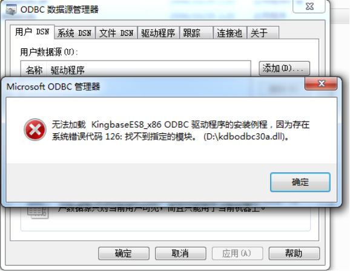
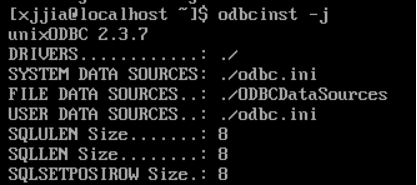
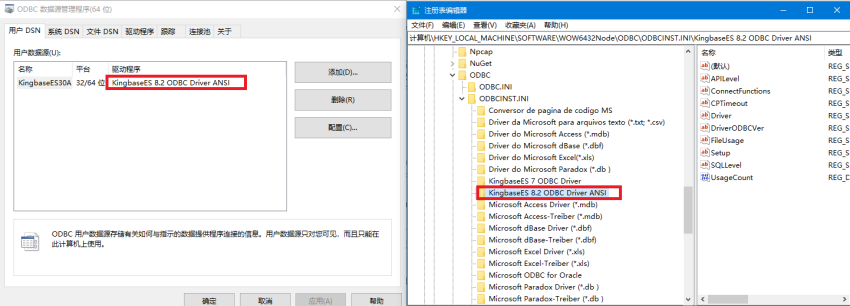
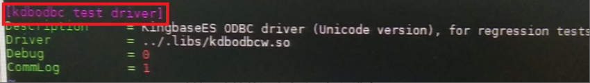

ODBC常见问题
=================

环境依赖
-------------------------

kingbase ODBC 驱动在windows下会依赖msvc120.dll，在没有安装VS的运行环境中，通过ODBC数据源工具配置DNS时，会提示如下错误：
     

解决方法: 如果使用的是32的驱动，则通过运行安装vcredist_x86(Microsoft Visual C++ 2013),如果是64位驱动，则运行安装vcredist_x64(Microsoft Visual C++ 2013）即可。

linux unixodbc通过连接串连接数据库操作，如何添加连接参数？
--------------------------------------------------------

unixodbc通过连接串连接数据库，连接串需要指定驱动名称，数据库服务器IP地址、端口号、用户名、密码、数据库名，驱动名称是配置在odbcinst.ini中的。具体的连接示例如下：

.. code::

  isql -k "Driver={kdbodbc test driver};Server=192.168.28.152;Database=TEST;Uid=SYSTEM;
  Password=123456;Port=54384"

Driver的赋值是odbcinst.ini中配置的驱动名称；

-k 为必不可少的参数，该参数制定使用SQLDriverConect作为连接函数。

linux环境下如何开启odbc驱动的日志？
----------------------------------

1. V7 ODBC 中添加日志打印控制项在odbc.ini中添加，如下图中

  .. figure:: images/odbc-2.png

  LogFile=日志位置

  LogLevel=debug5(备注：debug5为日志等级，该等级从debug1---debug5,日志信息量一次增加)

2. V8 ODBC 日志打印控制项在odbcinst.ini中添加，红色部分为添加项：

  .. figure:: images/odbc-3.png

  Trace = on 开启日志打印

  TraceFile = 日志存放位置

  上述两个参数时UNIXODBC日志，kingbase odbc日志配置项通过：

  Debug = 1

  CommLog = 1

  来设置,linux日志存放路径在/tmp路径下

linux下odbc驱动接口连接数据库失败，如何排查？
-------------------------------------------

1. 通过odbcinst -j 查看驱动所使用的配置文件所在路径，如下图：
   

2. 查验上述图中路径下的配置文件odbc.ini和odbcinst.ini中的配置项，是否正确，强调的是请认真核实各配置项的名称是否正确无误，主要配置项如下：

  odbcinst.ini:

        Driver = 驱动所在路径

  odbc.ini:

        Database = TEST(备注：数据库名)

        Servername = 127.0.0.1 (备注：数据库服务器IP地址)

        Username = SYSTEM(备注：用户名)

        Password = 123456(备注：密码)
        
        Port=54321(备注：端口号)

3. 查看驱动是否缺少依赖，如果缺少libunixodbcinst.so.2，可以添加unixodbc相关库至环境变量中，export LD_LIBRARY_PATH=/usr/local/lib(备注：该路径为unixodbc相关库的路)。

4. 通过isql kingbase(备注：odbc中配置的DNS名)连接测试，如果连接成功，驱动接口还是连接失败，则检查传递给接口的连接串参数是否不对；如果连接失败，排查前三步中是否有不正确的地方。

.. note::

   ODBCINSTINI、ODBCINI为设置配置文件的环境变量。

linux下odbc驱动开启日志？
------------------------

v8 ODBC一般有两种日志一种是Debug日志，一种是Commlog日志，给开发人员看的一般是Debug，设置方式有两种，一种是在odbc.ini中添加：

  odbc.ini:

        Database = TEST(备注：数据库名)

        Servername = 127.0.0.1 (备注：数据库服务器IP地址)

        Username = SYSTEM(备注：用户名)

        Password = 123456(备注：密码)

            Port=54321(备注：端口号)

            Debug=1(备注:Debug日志)

        在连接串中添加：

            "Driver={kdbodbc test driver};Server=192.168.28.152;Database=TEST;Uid=SYSTEM;Password=123456;Port=54384;Debug=1"

SQLFreeStmt()函数与SQLCloseCursor()有什么不同？
----------------------------------------------

首先SQLFreeStmt通过参数控制，可以关闭句柄关联的游标和放弃的挂起结果集，    如:SQLFreeStmt(hstmt, SQL_CLOSE),还可以释放语句句柄SQLFreeStmt(hstmt)，如：  SQLFreeStmt(hstmt, SQL_DROP)。

其次：SQLCloseCursor函数的功能只是关闭语句句柄关联的游标。

连接串中如何通过驱动名连接数据库，即不通过DNS连接数据库？
-------------------------------------------------------

在连接传中直接配置驱动名，连接串如下：

.. code::

    "Driver={kdbodbc test driver};Server=192.168.28.152;Database=TEST;Uid=SYSTEM;
      Password=123456;Port=54384;Debug=1"

1. 在windows中，驱动名可以是ODBC管理工具驱动程序一栏中的值，或者注册表中的驱动名称。

2. linux下，该驱动名为odbc.ini中

