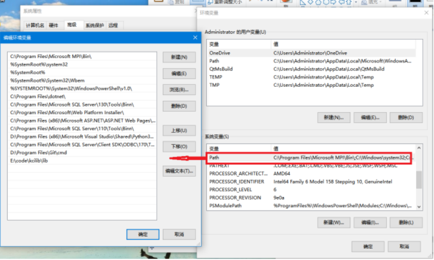
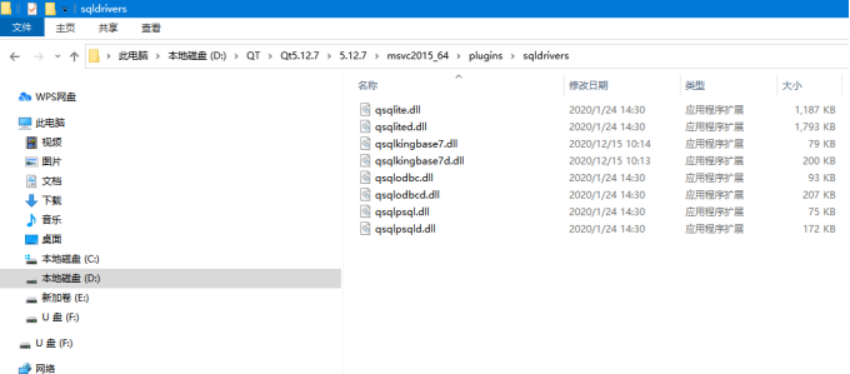

QT常见问题
====================

windows如何加载QT驱动
---------------------------------

1. 将libkci.dll的路径加至环境变量PATH中，如下图：

2. 将驱动QT数据库驱动拷贝至对应的QT安装路径plugins\sqldrivers,如下图：

提需求时，如何进行描述：
--------------------------------

首先是所需平台，如果是windows下的，就会更具编译器不同区分为mingw和msvc两个版本，平台位数，是32位还是64位，更具使用的VS版本不同，又分为vs2012,vs2015等，所以在windows下提需求因参照 位数+编译器版本(mingw或者msvc)+vs版本(2012/2013/2015)。

SSL认证如何配置
----------------------------

参考 :ref:`SSL认证常见问题 `