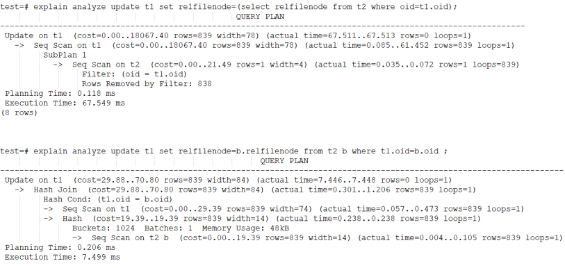
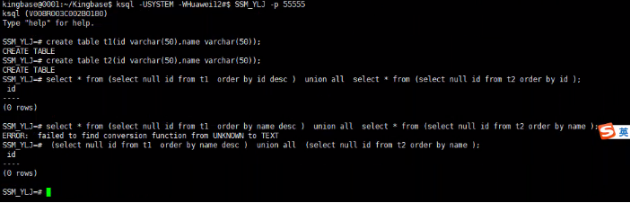

SQL类
======================

空值问题
--------------------

‘’ 与 null 兼容性
^^^^^^^^^^^^^^^^^^^

适用版本：V8R3 , V8R6

前提条件：数据库必须是oracle 模式

问题分析：参数ora_input_emptystr_isnull=on是为了兼容oracle 对于‘’作为null处理。

以下是oracle环境下，’’ 比较结果：

.. code::

   SQL> create table t1 (id integer, name char (9) ) ;
   Table created.
   SQL> insert into t1 values(1,'') ;
   1 row created. 
   SQL> select * from t1 where name='' ;
   no rows selected
   SQL> select * from t1 where name is null;
   ID NAME

同样，开启ora_input_emptystr_isnull参数后，KES结果如下：

.. code::

   test-# create table t1 (id integer,name char(9)) ;
   CREATE TABLE
   test=# insert into t1 values(1, '') ;
   INSERT 0 1
   test=# select * from t1 where name=' ' ;
   id | name
   ---+-------
   (10 rows )

   test=# select ★from t1 where name is null;
   id | namc
   ---+--------
   1  |
   (1 row)

   test=# show database_mode;
   database_mode
   ----------------
   oracle
   (1 row)

判断值是否为空，要用 is null
^^^^^^^^^^^^^^^^^^^^^^^^^^^^^^^^^^^^^^

适用版本：V8R3 , V8R6

问题描述：

   对于空值使用 =‘’ 返回结果与is null返回结果不同

   .. code::

      test=# show ora_input_emptystr_isnull;
      ora_input_emptystr_isnull
      ----------------------------
      on
      (1 row)

      test=# create table t1 (id1 integer ，id2 integer) ;
      CREATE TABLE
      test=# insert into t1 values (1, nul1) ;
      INSERT 0 1
      test=# insert into t1 values(2, '');
      INSERT 0 1
      test=# select * from t1 where id2 is null;
      id1 | id2
      ----+------
      1   |
      2   |
      (2 rows)

      test=# select * from t1 where id2='';
      id1  | id2
      -----+----- 
      (0 rows)

问题分析：当参数ora_input_emptystr_isnull=on时，’’会转换为null，而null表示不确定的值，因此，NULL值比较只能是IS NULL或IS NOT NULL，不可以是= NULL 或<> NULL的的形式判断，无论= NULL 或<> NULL，都是不成立的。

PG模式下，‘’ 值问题
^^^^^^^^^^^^^^^^^^^

适用版本：V8R6

问题分析：PG模式下，需要设置ora_input_emptystr_isnull=off，否则会有很多问题（因为这个参数本身就是为兼容oracle设置的，必须在oracle模式下使用）。

PG模式，‘’ 行为如下：

.. code::

   test=# show ora_input_emptystr_isnull;
   ora_input_emptystr_isnull 
   --------------------------
   off
   (1 rows)
   
   test=# select * from t1 where name='';
   id | name
   ---+-----
   1  |
   (1 rows)
   
   test=# select * from t1 where name is null;
   id | name
   ---+-----
   (0 rows)
   
   test=# set ora_input_emptystr_isnull=on;
   SET
   test=# select * from t1 where name='';
   id | name
   ---+-----
   1  |
   (1 rows)
   
   test=# select * from t1 where name is null;
   id | name
   ---+------
   (0 rows)

Ora_input_emptystr_isnull对于字符类型空值的影响
^^^^^^^^^^^^^^^^^^^^^^^^^^^^^^^^^^^^^^^^^^^^^^^^^^^^^^^^^

适用版本：所有版本

注意事项：本测试基于V8R6。该参数可能会因为bug，在不同版本结果可能不同，但理论上应该是本测试结果。

问题描述：当insert数据时，对于空值可以是 ‘’（中间没有空格）或 null，不同参数值结果是不同的，会影响后续的select访问结果。

问题分析：

   1) ora_input_emptystr_isnull=on 插入的数据，‘’和null都会转为null，之后的select操作不管ora_input_emptystr_isnull为何值，返回结果都相同：

   .. figure:: images/FAQ846.png
      :width: 516px
      :height: 523px

   2) 在ora_input_emptystr_isnull=off时插入的数据，ora_input_emptystr_isnull值不同，返回的结果也不同：

   .. figure:: images/FAQ925.png
      :width: 624px
      :height: 531px

测试结论：数据内部对于 ‘’ 与 null值的存储是不同的，当ora_input_emptystr_isnull=on 时，不管的insert ‘’， 还是 where col=’’ ，’’ 都会转为 null ，

Ora_input_emptystr_isnull对于数值类型空值的影响
^^^^^^^^^^^^^^^^^^^^^^^^^^^^^^^^^^^^^^^^^^^^^^^^^^^^^^^^^

适用版本：V8R6

问题描述：对于integer类型数据，当ora_input_emptystr_isnull=off时，’’对于insert 或 select 都会因为类型转换问题报错。

问题分析：

   当ora_input_emptystr_isnull=off时，’’当做字符串，无法转换成整型。当ora_input_emptystr_isnull=on 时，’’被转成null，而null 没有类型约束，所以转换没有问题。

   1) 当ora_input_emptystr_isnull=on ，insert 与 select 对于 ‘’ 都没问题

   .. figure:: images/FAQ1349.png
      :width: 380px
      :height: 297px

   2) 当ora_input_emptystr_isnull=off ，insert 与 select 对于 ‘’都有问题

   .. figure:: images/FAQ1410.png
      :width: 457px
      :height: 304px

Core分析
---------------------

多线程core分析
^^^^^^^^^^^^^^^^^^^

适用版本：V7

问题描述：如果现场的数据库core了，利用gdb进行分析时有多个thread，没法确定哪个thread才是真正core的？

问题分析： 

   kingbase 提供了HandleCrash函数，该函数被注册为一个信号处理函数，用来处理：SIGILL，SIGBUS，SIGSEGV等信号，其子函数：StandardHandlerForSigillSigsegvSigbus_OnMainThread 用来收集堆栈信息，进程信息，并且将他们写入管道中。如果现场中需要gdb重定向，需要以下方法：

   .. code::

      set logging file <file name>
      set logging on
      info threads
      thread n
      info functions
      set logging off

然后将对应的filename拷贝回来

如何生成core文件
^^^^^^^^^^^^^^^^^^^

适用版本：所有版本

问题描述：为什么没有生成core文件？\ core文件创建在什么位置？

问题解析：

   没生成core文件，可能是目录权限或limit设置太小。Redhat7采取abrtd服务，core文件在/var/spool/abrt目录。Core文件通常在进程当前工作目录的下创建，或与程序在相同的路径下。但如果程序中调用了chdir函数，则有可能改变了当前工作目录。这时core文件创建在chdir指定的路径下。Redhat7使用abrtd （automatically bug report daemon ）服务，core文件会在/var/spool/abrt/ccpp\* 目录下。

   以Centos7 为例：

   1、 确认针对用户的core文件大小没有限制。

   .. figure:: images/FAQ2141.png
      :width: 243px
      :height: 34px

   2、 修改/etc/abrt/abrt-action-save-package-data.conf文件，并重启abrtd服务（如果不行，重启服务器）。

   .. code::

      OpenGPGCheck = no 
      ProcessUnpackaged = yes  

   3、 确认/var/spool/abrt 目录下有生成ccpp* 之类的文件。

如何查看core文件
^^^^^^^^^^^^^^^^^^^6

适用版本：所有版本

问题描述：如何分析core文件

问题分析：

   1、 确认core文件是哪个程序生成的

   .. figure:: images/FAQ2359.png
      :width: 650px
      :height: 44px

   2、 使用gdb分析core文件。

   .. figure:: images/FAQ2376.png
      :width: 649px
      :height: 426px

关键字问题
------------------------

如何确认是否系统关键字
^^^^^^^^^^^^^^^^^^^^^^^^^^^^

适用版本：V8R6

问题描述：RT

问题解答：

   可以通过函数pg_get_keywords取得系统的所有关键字列表。

   Keyword分类解释：

   1、unreserved，不保留，可以用于任何identity（视图、表、函数、类型、索引、字段、类型等名称）。

   2、reserved，保留，不可用于任何identity。

   3、reserved (can be function or type name)，保留，但是可用于函数、类型名。

   4、unreserved (cannot be function or type name)，不保留，但是不可用于函数、类型名。

   .. note::

      虽然unreserved 的关键字可以用于字段名等，但不能用于列别名。

   .. figure:: images/FAQ2717.png
      :width: 367px
      :height: 140px

 

乱码或无效字符编码
----------------------------

适用版本：所有版本

问题描述：

   - 问题1：为什么界面有时会显示中文乱码？

   - 问题2：终端查询类似\ “invalid byte sequence for encoding “utf8”: 0xd0 ” 报错

   - 问题3：应用报错\ “com.kingbase8.util.KSQLException: 错误: 无效的 "GBK" 编码字节顺序: 0xe8”

问题分析：

   1. client_encoding与server_encoding 之间不一致，在存储或读取数据时，会自动进行转换，不会有乱码问题。

   2. 问题1、2 主要是显示问题，比如客户端的字符集client_encoding与工具的字符集（如SecureCRT）不一致。这种情况影响的只是显示，而不影响数据存储。

   3. 对于问题3， 可以“看下驱动是否支持连接参数bytestype，指定bytestype=bytea”，或者在插入数据时强制类型转换。

几种字符编码：

   1、查看操作系统的编码env | grep LANG

   2、show server_encoding查看数据库编码，一般与环境变量LANG相同，除非手动设置。

   3、show client_encoding 查看客户端编码

Windows版本安装未注册服务
--------------------------------------

适用版本：V8R3

问题描述：windows版本安装未注册服务

问题分析：先检查是否安装好了vcredist \_2013(vc 2013的最小化运行环境)。vcredist 2013 x64是windows系统中非常重要的运行库文件，这个文件是保证电脑系统正常运行的必备软件，一般用Visual C++开发的Windows应用程序需要这个运行时库的支持才能在没有安装Visual C++的计算机上正常运行

如何创建一个间隔分区
------------------------------

适用版本：V8R3

问题描述：如何使用SYS_PATHMAN 创建间隔分区

尤其特别注意红色部分参数设置

.. code::

   CREATE TABLE range_rel (
   id SERIAL PRIMARY KEY,
   dt TIMESTAMP,
   txt TEXT);
   INSERT INTO range_rel (dt, txt)
   SELECT g, md5(g::TEXT) FROM generate_series('2015-01-01', '2015-04-30', '1 day'::interval) as g;
   set ora_func_style = false;
   SELECT create_range_partitions('RANGE_REL', 'DT', '2015-01-01'::DATE, '1 month'::INTERVAL);
    CREATE_RANGE_PARTITIONS
   -------------------------
                          4
   (1 row)
   TEST=# \d+ RANGE_REL;
                                                          Table "PUBLIC.RANGE_REL"
    Column |            Type             |                       Modifiers                        | Storage  | Stats target | Description

   --------+-----------------------------+--------------------------------------------------------+----------+--------------+------------
   -
    ID     | INTEGER                     | not null default NEXTVAL('RANGE_REL_ID_SEQ'::REGCLASS) | plain    |              |
    DT     | TIMESTAMP WITHOUT TIME ZONE |                                                        | plain    |              |
    TXT    | TEXT                        |                                                        | extended |              |
   Indexes:
       "RANGE_REL_PKEY" PRIMARY KEY, BTREE (ID)
   Child tables: RANGE_REL_1,
                 RANGE_REL_2,
                 RANGE_REL_3,
                 RANGE_REL_4

 

[KESV8R2/3] 客服端服务器编码原理说明
---------------------------------------------

服务器存储数据：客户端检查输入的字串是否符合client_encoding，若符合则发给服务器，否则抛出错误-->服务器接受到客户端发过来的字符串及client_encoding，字符串通过client_encoding转server_encoding，转换成服务器编码风格-->以服务器编码风格存入字符串。

客户端取数据数据：数据通过server_encoding转client_encoding，最后发给客户端。

.. note::

   上面已经说到存是数据通过client_encoding转server_encoding，转换成服务器编码风格并写入系统字典，客户端取数据是通过server_encoding转client_encoding。然而数据库中存在数据库公有数据字典，这可能导致存取的服务器server_encoding编码不一致，从而数据出错。所以建议用户不要创建中文名用户、中文名数据库以及中文名的过程语言(如plsql)。数据库登录时server_encoding并未生效，所以登录时采用的是Unicode编码进行数据库名验证。

兼容MySQL参数sql_mode
-------------------------------

适用版本：V8R3 , V8R6

问题描述：KES数据库group by 操作与mysql 结果不同

问题分析：

   MySQL 的group by : MySQL支持selectlist中非聚集列可以不出现在group by中。sql标准是必须出现在group by中， 如：select col1, col2 from tab group by col1; kingbase 为兼容mysql，设置了个参数ql_mode参数，目前只支持ONLY_FULL_GROUP_BY选项。如果sql_mode中不包含ONLY_FULL_GROUP_BY，group by语句可以不符合sql标准。 也就是与mysql结果相同。 

   .. figure:: images/FAQ5663.png
      :width: 650px
      :height: 268px

MySQL date_format改写
--------------------------------

适用版本：V8R3 , V8R6

问题描述：KES 是否有类似MySQL的date_format日期格式函数

问题解答：

   - Mysql：select date_format(CURRENT_TIMSTAMP,‘%Y-%m-%d %H:%i:%s’)

   - KES：select to_char (CURRENT_TIMSTAMP,‘yyyy-mm-dd hh24:mi:ss’)

共有同义词和私有同义词有什么区别
-----------------------------------------

适用版本：V8R3 , V8R6

问题描述：创建同义词，报错如下：ERROR:  missing or invalid synonym identifier,the current default schema is public

问题解析：KES同义词分为两类：公有同义词，在public模式下；私有同义词，在其他模式下。当创建同义词时，如果是建在public模式下，则必须加public关键字，否则报错。

.. code::

   test=# select current_user;
    current_user 
   --------------
    system
   (1 row)

   test=# show search_path;
      search_path   
   -----------------
    "$user", public
   (1 row)

   test=# create synonym ps_t2 for t2;
   ERROR:  missing or invalid synonym identifier,the current default schema is public
   test=# create public synonym ps_t2 for t2;
   CREATE SYNONYM
   test=# drop synonym ps_t2;
   ERROR:  synonym "ps_t2" does not exist
   test=# drop public synonym ps_t2;
   DROP SYNONYM

.. note::

   这里是参照oracle模式来的，oracle用户即模式，所以私有同义词在用户名模式下。

同义词查找规则
--------------------------

适用版本：V8R3 , V8R6

问题描述：用户查找同义词的先后规则

问题分析：

   KES实际根据Search_path的先后顺序查找用户模式，可以通过设置search_path，影响搜索的先后顺序。

   Oracle：—>私有同义词—>共有同义词

   Kes：—>search_path

   这里为了和oracle查询一致，可以将search_path改成用户模式，PUBLIC(用户模式在前，PUBLIC在后，一般兼容oracle情况，也是采取的先用户模式再public模式)

如何查询版本的提交号
----------------------------

适用版本：V8R3 , V8R6

问题描述：RT

问题解决：Select build_version();

.. note::

   build_version 函数实际是kingbase_version插件生成的

遇到关键字无法使用作为表名或列名
-------------------------------------------

适用版本：V8R3 大小写敏感版本

问题描述：RT

问题解析：一般出现无法使用作为表名或列名的关键字，我们都采取将表或列名用双引号将其引用。使用双引号(标识符)时，表名和列名区分大小写，这意味着被标识符包起来的对象，写到数据库的原信息就是区分大小写的。

例子如下：

.. code::
 
   不使用标识符“”时候：
   TEST=# create table tb2(create int);
   ERROR:  syntax error at or near "create"
   LINE 1: create table tb2(create int);
                            ^
   TEST=# create table tb3(col int);
   CREATE TABLE
   TEST=# \d+ tb3;
                            Table "PUBLIC.TB3"
    Column |  Type   | Modifiers | Storage | Stats target | Description
   --------+---------+-----------+---------+--------------+-------------
    COL    | INTEGER |           | plain   |              |
   
   使用标识符时候：
   TEST=# create table "tb4"("col" int);
   CREATE TABLE
   TEST=# \d+ tb4;
   Did not find any relation named "tb4".
   TEST=# \d+ "tb4";
                            Table "PUBLIC.tb4"
    Column |  Type   | Modifiers | Storage | Stats target | Description
   --------+---------+-----------+---------+--------------+-------------
    col    | INTEGER |           | plain   |              |

   TEST=# create table tb5("create" int);
   CREATE TABLE
   TEST=# \d+ tb5;
                            Table "PUBLIC.TB5"
    Column |  Type   | Modifiers | Storage | Stats target | Description
   --------+---------+-----------+---------+--------------+-------------
    create | INTEGER |           | plain   |              |

Nextval在同一条语句中的值
-----------------------------------------

适用版本：V8R3

问题描述：oracle序列nextval在同一条语句中是一样的值，KES却是增长的值

问题解析：这个和ora_func_style参数有关，ora_func_style为true的时候兼容oracle序列风格，如下验证：

.. code::

   TEST=# show ora_func_style ;
    ora_func_style
   ----------------
    on
   (1 row)

   TEST=# select serial.nextval, serial.nextval;
    NEXTVAL | NEXTVAL
   ---------+---------
        116 |     116
   (1 row)

   TEST=# set ora_func_style = false;
   SET
   TEST=# select serial.nextval, serial.nextval;
    NEXTVAL | NEXTVAL
   ---------+---------
        118 |     119
   (1 row)

.. note::

   对于R6版本，没有ora_func_style参数，如果database_mode=oracle，表示兼容oracle模式，在一条SQL内，nextval值也是相同的。

能为模式指定表空间吗？
------------------------------------

适用版本：V8R3 , V8R6

问题描述：RT

问题解答：创建用户或schema时，都不支持指定表空间，一般只有数据库和表能够指定表空间。

丢失了数据库密码，如何恢复？
------------------------------------------

适用版本：V8R3 , V8R6

问题描述：RT

问题解答：

   无法恢复密码，但是，你可以将其重置为其他密码。为此，你可以用如下方式重置密码

   1. 编辑sys_hba.conf以暂时允许信任授权(trust)

   2. 重新加载配置文件（重新加载sys_ctl）

   3. 连接并通过ALTER ROLE PASSWORD设置新密码

   4. 再次编辑sys_hba.conf并恢复之前的设置

   5. 再次重新加载配置文件

序列的cache
----------------------------

适用版本：V8R3 , V8R6

问题描述：为什么我的序列SERIAL列的编号存在间隙？为什么在事务异常终止时我的序列号没有被重用？为什么不同会话不同会话间nextval差距很大？

问题解答：为了提高并发性，每个会话会按照序列的cache参数大小，在用户的私有内存空间缓存一定数量的序列值。在服务器关闭（stop fast）或会话退出时，会丢弃会话缓存的序列值，因此，序列值会出现跳跃。

.. note::

   如果要保证序列的取值不出现跳跃，保证不同会话间的取值完全按时间顺序的，可以设置cache 0。但无论如何事务rollback，序列值是不能重用的。

什么是OID？
----------------------------

适用版本：V8R3

问题描述：RT

问题解析：

   - 如果使用WITHOIDS创建表，则每一行都包含一个OID伪列，该列将在INSERT期间自动填充。OID被顺序分配4字节整数。最初，它们在整个安装过程中都是唯一的。但是，OID计数器大约为40亿个，此后可能会重复OID。

   - 通过在OID列上创建唯一索引，可以防止单个表中的OID重复（但请注意，WITH OIDS子句本身不会创建此类索引）。系统检查索引以查看是否已经存在新生成的OID，如果存在，则生成新的OID。重复该操作，直至满足唯一约束。因此，如果表内的数据已经很多，整个过程是非常低效的。

   - 要对用户表中的行进行唯一编号，最好使用SERIAL而不是OID列，如果期望该表在其整个生命周期中拥有超过20亿个条目，则最好使用bigserial。

什么是CTID？
----------------------------

适用版本：V8R3 , V8R6

问题描述：RT

问题解析：

   - CTID通过表中的块和偏移位置来标识特定的物理行。

   - 索引条目使用它们来指向物理行。

   - 行的CTID在更新时会更改，因此CTID不能用作长期行标识符。

   - 格式(blockid,itemid)：拿其中(0,1)来说；0表示块id；1表示在这块第一条记录。

数据库大小限制
----------------------------

适用版本：V8R3

问题描述：行，表和数据库的最大大小是多少？

问题解答：

   以下这些是限制：

   - 数据库的最大大小？无限（存在32 TB数据库）

   - 表的最大尺寸？32 TB

   - 一行的最大大小？400 GB

   - 字段的最大大小？1 GB

   - 表中的最大行数？无限

   - 表中的最大列数？250-1600，取决于列类型

   - 一个表上的最大索引数？无限

   当然，这些实际上并不是无限的，而是限于可用的磁盘空间和内存/交换空间。当这些值变得异常大时，性能可能会受到影响。

   最大表大小为32 TB，不需要操作系统提供大文件支持。大表存储为多个1GB文件，因此文件系统大小限制并不重要。通过将默认块大小增加到32k，最大表大小，行大小和最大列数可以增加三倍。也可以使用表分区来增加最大表大小。

   一个限制是不能在长度超过2,000个字符的列上创建索引。最好通过长列的MD5哈希的函数索引来保证唯一性，并且全文索引允许在列中搜索单词。

.. note::
   
   如果存储的表中的行大小超过2KB（每行中数据的总大小），则“表中的最大行数”可能限制为40亿或更少。

KES数据页结构
----------------------------

适用版本：所有

问题描述：数据行存储需要哪些额外的空间？

问题解析：

   例如，考虑一个100,000行的文件，每行有一个整数和文本描述。假设文本字符串的平均长度为二十个字节。文件大约为2.8MB。包含此数据的kingbase数据库文件的大小估计为5.2 MB

   每行52个字节：

      - 24字节：每行头（大约）

      - 24个字节：1个int字段和1个文本字段

      - + 4个字节：页面上指向元组的指针

   kingbase中的数据页大小为8192字节（8KB），因此：每个数据库页面8192/52=158行（四舍五入）。注意，这里假设fillfactor是100%。

   大约需要 633个数据库页面（向上舍入）

   633个数据库页面*每页8192字节= 5,185,536字节（5.2 MB）

   索引不需要那么多的开销，但是确实包含要建立索引的数据，因此它们也可能很大。

   NULL存储为位图，因此它们使用的空间很小。

.. note::
   
   大字段可能会透明压缩

如何将数据从客户端通过copy命令导入数据库
--------------------------------------------------------

适用版本：所有

问题描述：RT

问题解答：通过copy导入数据，要求数据在数据库服务器上，如果数据在客户端机器上，需要用 \\copy

Windows 如何配置免密登录
----------------------------

适用版本：所有

问题描述：RT

问题解答：

   Linux通过配置 .kbpass，用户可以免密登录数据库。Windows下，对应文件是%APPDATA%\kingbase\kbpass.conf。文件内容格式：

   hostname:port:database:username:password

命令报参数错误问题
----------------------------

适用版本：所有

问题描述：命令正确，却报奇怪的错误

问题描述：

   用户命令格式报错，但实际命令是正确的。如下图：

   .. figure:: images/FAQ11099.png
      :width: 554px
      :height: 34px

原因分析：命令内部包含非法字符。这种问题原因很难排查，需要使用时注意。

To_date 函数问题
----------------------------

问题描述：to_date 函数显示结果与oracle不一致

验证版本：V8R6C2

原因分析：

   系统除pg_catalog下有to_date函数外，组件kdb_oracle_datatype也会在sys用户下创建to_date函数，二者返回值是有区别的。默认调用的是sys用户下的。

   具体例子如下：

   .. figure:: images/FAQ11300.png
      :width: 393px
      :height: 336px

视图源定义信息为啥和创建的语句不一样
--------------------------------------------------------

适用版本：所有版本

问题解析：视图源定义信息是存在pg_description.description列中，这里有的和创建语句一致，有的不一致。这个和视图的状态有关。下面是获取视图定义的信息规则：

- 有效视图：通过Sys_rewrite规则query查询树，反解析query查询获得视图的定义信息。

- 无效视图：直接通过pg_description.description，得到定义信息

获取视图定义：查询sys_get_viewdef（reloid），如下例子

.. code::

   TEST=# create force view vtest as select * from test;
   WARNING:  View created with compilation errors
   CREATE VIEW
   TEST =# select sys_get_viewdef('VTEST'::regclass);
      PG_GET_VIEWDEF
   ---------------------
    select * from test;

字符串类型长度怎么获取
----------------------------

适用版本：V8R3 , V8R6

问题分析：对于字符类型数据，pg_attribute.attlen值为 -1。字符串类型长度是 abs(atttypmod) – 4.

如何改变sys_guid() 返回值类型
----------------------------

适用版本：V8R3

问题描述：sys_guid函数默认返回的是16进制的串的ascii编码，通过修改参数guid_default_return_type=name，可以返回16进制字符串，但修改参数时，会发现参数实际已修改，但没效果。

问题分析：

   以上问题是由于修改过程没有运行alter_sys_guid()函数导致的。修改过程如下：

   - 修改参数guid_default_return_type；

   - 重启数据库；

   - 执行 select alter_sys_guid()。这个实际是重建sys_guid()函数，根据参数guid_default_return_type决定是调用sys_guid_bytea，还是调用sys_guid_name。

   Alter_sys_guid 函数的内容：

   .. code::

      begin                                                                                                                                                            
        select setting into return_type from sys_catalog.sys_settings where name = 'guid_default_return_type';                                                         
        if lower(return_type) = 'bytea' then                                                                                                                           
          stmt = 'DROP FUNCTION IF EXISTS sys_catalog.sys_guid(); 
           CREATE OR REPLACE INTERNAL FUNCTION sys_catalog.sys_guid() RETURNS BYTEA AS 
      $$SELECT sys_catalog.sys_guid_bytea()$$ LANGUAGE sql;';
        else                                                                                                                                                           
          stmt = 'DROP FUNCTION IF EXISTS sys_catalog.sys_guid(); 
           CREATE OR REPLACE INTERNAL FUNCTION sys_catalog.sys_guid() RETURNS NAME AS 
      $$SELECT sys_catalog.sys_guid_name()$$ LANGUAGE sql;';  
        end if; 
      end;

   .. note::

      对于R6 版本，没有alter_sys_guid，需要手动修改创建脚本。

OPENSSL问题
----------------------------

适用版本：所有版本

问题描述：

用户使用sys_rman可能会遇到如下错误：

.. code::

   could not load the shared library:crypto/dso/dso_dlfcn.c:113:filename(libssl_conf.so):
   libssl_conf.so: cannot open shared object file: No such file or directory

问题解决：

   在UOS/Debain的系统中，修改配置文件/etc/profile 增加一行：export OPENSSL_CONF=/etc/ssl/

   如果还未能解决问题，可以修改archive_command，在命令行前加“export OPENSSL_CONF=/etc/ssl/”

Pg_relation_size 问题
----------------------------

适用版本：V8R3 , V8R6

问题描述：pg_relation_size 是否包含clob等大字段大小

问题解答：不包含行外存储的数据段大小。pg_relation_size是根据 schema.relname取得表的relfilenode，从而确认表大小。不包括reltoastrelid。

全角字符支持
----------------------------

适用版本：V8R6

问题描述：用户应用开发不规范，SQL 中间掺杂全角字符，比如“，”。

问题解析：

   V8R6对于中文符号进行部分兼容，其中包括全角逗号、空格等。如：

   .. figure:: images/FAQ13964.png
      :width: 243px
      :height: 56px

时间函数问题
----------------------------

适用版本：V8R3 , V8R6

问题描述：为什么有的时间函数在同一事务内返回的都是同一值？

问题解析：

   KES的认为返回事务开始时间点的时间有利于保证同一事务的多个修改保持同样的时间戳。这点与oracle机制不同，oracle默认返回命令执行时间点的时间戳。实际上KES同时提供了两类函数：

   - 以下函数返回事务开始的时间戳：

    .. code::

      transaction_timestamp()
      now()

   - 以下返回语句执行时的时间戳

    .. code::

      statement_timestamp()
      clock_timestamp()
      timeofday

如何取得对象的DDL信息
----------------------------

适用版本：V8R6

问题描述：RT

问题解答：

V8R6提供了类似oracle dbms_metadata的包，用于获取对象的定义信息。

.. code::

   test=# select dbms_metadata.GET_DDL('table','t1');
            get_ddl          
   --------------------------
    CREATE TABLE PUBLIC.T1( +
     ID INTEGER             +
    )                       +
    
   test=# select dbms_metadata.get_index_ddl('ind_t1','public');
                      get_index_ddl                   
   ---------------------------------------------------
    CREATE INDEX ind_t1 ON public.t1 USING btree (id)+

全表update非常慢
----------------------------

适用版本：V8R6

问题描述：全表关联update时，效率非常低

问题解决：请看以下两种update方法。方法一采用loop方式，效率非常低。而方法二采用hash方式进行连接，效率高

Failed to find conversion function from UNKNOWN to TEXT
-----------------------------------------------------------------

适用版本：V8R3B0170 , B0180

问题例子：

问题解决：升级到 190之后或160之前的版本。